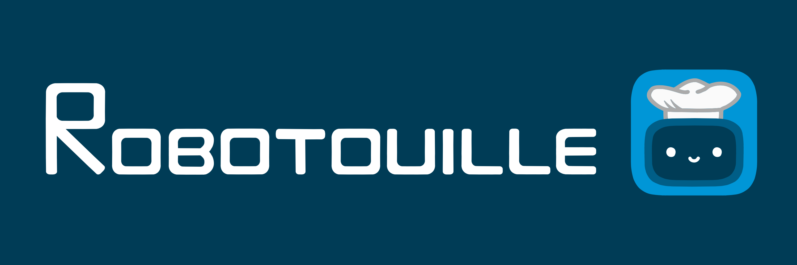

<a name="readme-top"></a>

<!-- PROJECT LOGO -->
<br />
<div align="center">
  <a href="https://github.com/portal-cornell/robotouille">
    
  </a>
  
  <p align="center">
    A challenging benchmark for testing LLM agent planning capabilities!
    <br />
    <br />
    <a href="https://arxiv.org/pdf/2502.05227">Paper</a> |  
    <a href="https://portal-cornell.github.io/robotouille/">Project Website</a> |
    <a href="https://github.com/portal-cornell/robotouille/issues">Request Feature</a>
  </p>
</div>


<!-- TABLE OF CONTENTS -->
<details>
  <summary>Table of Contents</summary>
  <ol>
    <li>
      <a href="#about-the-project">About The Project</a>
    </li>
    <li>
      <a href="#getting-started">Getting Started</a>
      <ul>
        <li><a href="#setup">Setup</a></li>
      </ul>
    </li>
    <li><a href="#leaderboard">Leaderboard</a></li>
    <li>
      <a href="#usage">Usage</a>
      <ul>
        <li><a href="#use-existing-environments">Use Existing Environments</a></li>
        <li><a href="#create-your-own-environment">Create your own Environment!</a></li>
      </ul>
    </li>
    <li><a href="#contributing">Contributing</a></li>
    <li><a href="#built-with">Built With</a></li>
    <li><a href="#citation">Citation</a></li>
    <li><a href="#license">License</a></li>
    <li><a href="#contact">Contact</a></li>
    <li><a href="#acknowledgments">Acknowledgments</a></li>
  </ol>
</details>


<!-- ABOUT THE PROJECT -->
## About The Project

<p align="middle">
  
</p>

Robotouille is a challenging benchmark environment designed to test LLM agents on 30 complex long-horizon planning, including synchronous, asynchronous, and multi-agent scenarios. Each scenario comes with a curated dataset containing 10 unique tasks each with 10 procedurally generated instances, designed to evaluate reasoning over time delays, diverse long-horizon tasks, and coordination challenges.

Check out the following papers where we've used Robotouille!
- [Robotouille: An Asynchronous Planning Benchmark for LLM Agents](https://portal-cornell.github.io/robotouille/)
- [Demo2Code: From Summarizing Demonstrations to Synthesizing Code via Extended Chain-of-Thought](https://portal-cornell.github.io/demo2code/)
- [Query-Efficient Planning with Language Models](https://portal-cornell.github.io/llms-for-planning/)


<p align="right">(<a href="#readme-top">back to top</a>)</p>


<!-- LEADERBOARD -->
## Leaderboard
| Strategy       | Synchronous (%) | Asynchronous (%) |
| -------------- | --------------- | ---------------- |
| [ReAct] (gpt-4o)     | **47.0**     | **11.0**     |
| [ReAct] (gpt-4o-mini)     | 11.0     | 0.00     |
| [ReAct] (Qwen2-72B-Instruct)     | 7.00     |2.00     |
| [ReAct] (Qwen2-32B-Instruct)     | 6.00     |1.00     |
| [ReAct] (claude-3-haiku)     | 2.00     | 0.00     |
| [ReAct] (Meta-Llama-3.1-70B-Instruct)     | 2.00     | 0.00     |
| [ReAct] (Meta-Llama-3.1-8B-Instruct)     | 1.00     | 0.00     |

<p align="right">(<a href="#readme-top">back to top</a>)</p>


<!-- GETTING STARTED -->
## Getting Started

It is super easy to get started by trying out an existing environment or creating your own environment!

### Setup

1. Create and activate your virtual environment
   ```sh
   # Python venv module
   python -m venv robotouille
   source robotouille/bin/activate
   # Conda (must have anaconda installed)
   conda create --name robotouille python=3.9
   conda activate robotouille
   # Pyenv (must have pyenv and pyenv-virtualenv installed)
   pyenv install 3.9
   pyenv virtualenv 3.9 robotouille
   ```
2. Clone and cd into the repository
   ```sh
   git clone https://github.com/portal-cornell/robotouille.git
   cd robotouille
   ```
2. Install Robotouille and its dependencies
   ```sh
   pip install -e .
   pip install -e agents/prompt_builder/gpt-cost-estimator
   ```
3. Run Robotouille!
   ```sh
   python main.py
   ```
   or import the simulator to any code by adding
   ```python
   from robotouille import run_robotouille
   
   run_robotouille("original", "human", max_steps=10)
   ```

<p align="right">(<a href="#readme-top">back to top</a>)</p>

## Usage

### Running an LLM Agent
Refer to the `README.md` under `agents/` for details on how to run an LLM agent in Robotouille.

### Use Existing Environments

To play an existing environment, you can choose from the JSON files under `environments/env_generator/examples/`. For example, to play the `high_level_lettuce_burger` environment, simply run
```sh
python main.py ++game.environment_name=high_level_lettuce_burger
```

You can interact with the environment with keyboard and mouse, using the following keys:
- Click to move the robot to stations and pick up or place down objects. You can also stack and unstack objects by clicking.
- 'e' can be used to cut objects at cutting boards or cook patties at stoves.
- 'space' can be used to stay in place (e.g. you are waiting for a patty to cook)

If you would like to procedurally generate an environment based off a JSON file, run the following commands
```sh
python main.py ++game.environment_name=high_level_lettuce_burger ++game.seed=42
```
Refer to the `README.md` under `environments/env_generator/` for details on procedural generation.

### Create your own Environment!

To create your own environment, add another example into `environments/env_generator/examples/`. Follow the `README.md` under `environments/env_generator/` for details on how to customize the environment JSON. If you would like to modify the transitions of the environment entirely, refer to `robotouille.json` under `environments`. We are always adding more objects and transitions into Robotouille to increase the diversity of tasks. Please contact gg387@cornell.edu for more details if interested in contributing or learning more.

<p align="right">(<a href="#readme-top">back to top</a>)</p>


<!-- CONTRIBUTING -->
## Contributing

We appreciate all contributions to Robotouille. Bug fixes are always welcome, but we recommend opening an issue with feature requests with the Feature Request label or reaching out to us if you want to implement a new feature.

<p align="right">(<a href="#readme-top">back to top</a>)</p>


<!-- BUILT WITH -->
## Built With

We build atop [Gym](https://www.gymlibrary.dev/index.html) environment and we render and take keyboard input using [PyGame](https://www.pygame.org/docs/), building on the [tutorial](https://www.gymlibrary.dev/content/environment_creation/) for making custom gym environments.

[Currently broken [#37](https://github.com/portal-cornell/robotouille/issues/37)] We also support [PDDLGym](https://github.com/tomsilver/pddlgym); we programatically translate Robotouille into a PDDL domain and problem file which PDDLGym converts into a Gym environment.

<p align="right">(<a href="#readme-top">back to top</a>)</p>


<!-- CITATION -->
## Citation
Please cite the [Robotouille](https://arxiv.org/pdf/2502.05227) paper if you use our dataset or code in your research:
```
@inproceedings{
  gonzalez-pumariega2025robotouille,
  title={Robotouille: An Asynchronous Planning Benchmark for {LLM} Agents},
  author={Gonzalo Gonzalez-Pumariega and Leong Su Yean and Neha Sunkara and Sanjiban Choudhury},
  booktitle={The Thirteenth International Conference on Learning Representations},
  year={2025},
  url={https://openreview.net/forum?id=OhUoTMxFIH}
}
```

<p align="right">(<a href="#readme-top">back to top</a>)</p>


<!-- LICENSE -->
## License

Distributed under the MIT License. See `LICENSE.txt` for more information.

<p align="right">(<a href="#readme-top">back to top</a>)</p>


<!-- CONTACT -->
## Contact

Gonzalo Gonzalez - gg387@cornell.edu

Project Link: [https://github.com/portal-cornell/robotouille](https://github.com/portal-cornell/robotouille)

<p align="right">(<a href="#readme-top">back to top</a>)</p>


<!-- ACKNOWLEDGMENTS -->
## Acknowledgments

We thank [Nicole Thean (@nicolethean)](https://github.com/nicolethean) for her help with creating the assets that bring Robotouille to life!

<p align="right">(<a href="#readme-top">back to top</a>)</p>
