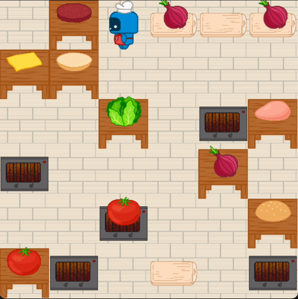
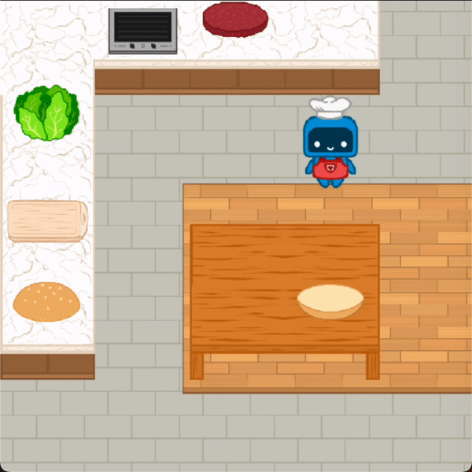
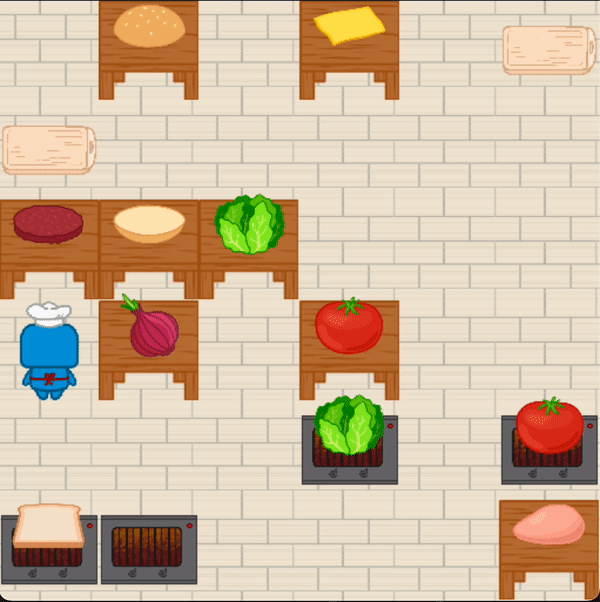

<a name="readme-top"></a>

<!-- PROJECT LOGO -->
<br />
<div align="center">
  <a href="https://github.com/portal-cornell/robotouille">
    
  </a>
  
  <p align="center">
    A customizable multi-task cooking environment!
    <br />
    <br />
    <a href="https://github.com/portal-cornell/robotouille/issues">Request Feature</a>
  </p>
</div>


<!-- TABLE OF CONTENTS -->
<details>
  <summary>Table of Contents</summary>
  <ol>
    <li>
      <a href="#about-the-project">About The Project</a>
    </li>
    <li>
      <a href="#getting-started">Getting Started</a>
      <ul>
        <li><a href="#setup">Setup</a></li>
      </ul>
    </li>
    <li>
      <a href="#usage">Usage</a>
      <ul>
        <li><a href="#use-existing-environments">Use Existing Environments</a></li>
        <li><a href="#create-your-own-environment">Create your own Environment!</a></li>
      </ul>
    </li>
    <li><a href="#contributing">Contributing</a></li>
    <li><a href="#built-with">Built With</a></li>
    <li><a href="#license">License</a></li>
    <li><a href="#contact">Contact</a></li>
    <li><a href="#acknowledgments">Acknowledgments</a></li>
  </ol>
</details>


<!-- ABOUT THE PROJECT -->
## About The Project

<p align="middle">
  
  
  
</p>

Robots will be involved in every part of our lives in the near future so we need to teach them how to perform complex tasks. Humans break apart complex tasks like making hamburgers into smaller subtasks like cutting lettuce and cooking patties. We can teach robots to do the same by showing them how to perform easier tasks subtasks and then combine those subtasks to perform harder tasks. We created Robotouille so we can stress test this idea through an easily customizable cooking environment where the task possibilities are endless!

Check out our paper, [Demo2Code: From Summarizing Demonstrations to Synthesizing Code via Extended Chain-of-Thought](https://portal-cornell.github.io/demo2code-webpage/), to learn how we used Robotouille to teach robots to perform tasks that humans demonstrate to them using Large Language Models (LLMs).

<p align="right">(<a href="#readme-top">back to top</a>)</p>


<!-- GETTING STARTED -->
## Getting Started

It is super easy to get started by trying out an existing environment or creating your own environment!

### Setup

1. Create and activate your virtual environment
   ```sh
   python3 -m venv <venv-name>
   source <venv-name>/bin/activate
   ```
2. Install Robotouille and its dependencies
   ```sh
   pip install -e .
   ```
3. Run Robotouille!
   ```sh
   python main.py
   ```
   or import the simulator to any code by adding
   ```python
   from robotouille import simulator
   
   simulator("original")
   ```

<p align="right">(<a href="#readme-top">back to top</a>)</p>

## Usage

### Use Existing Environments

To play an existing environment, you can choose from the JSON files under `environments/env_generator/examples/`. For example, to play the `high_level_lettuce_burger` environment, simply run
```sh
python main.py --environment_name high_level_lettuce_burger
```

You can interact with the environment with keyboard and mouse, using the following keys:
- Click to move the robot to stations and pick up or place down objects. You can also stack and unstack objects by clicking.
- 'e' can be used to cut objects at cutting boards or cook patties at stoves.
- 'space' can be used to stay in place (e.g. you are waiting for a patty to cook)

If you would like to procedurally generate an environment based off a JSON file, run the following commands
```sh
python main.py --environment_name high_level_lettuce_burger --seed 42
python main.py --environment_name high_level_lettuce_burger --seed 42 --noisy_randomization
```
Refer to the `README.md` under `environments/env_generator` for details on procedural generation.

### Create your own Environment!

To create your own environment, add another example into `environments/env_generator/examples/`. Follow the `README.md` under `environments/env_generator` for details on how to customize the environment JSON. If you would like to modify the transitions of the environment entirely, refer to `robotouille.pddl` under `environments`. We currently have limited support for customization through the PDDL for non-Markovian actions (cut / cook) and for rendering new objects / actions but plan to add more support in the future. Please contact gg387@cornell.edu for more details if interested.

<p align="right">(<a href="#readme-top">back to top</a>)</p>


<!-- CONTRIBUTING -->
## Contributing

We appreciate all contributions to Robotouille. Bug fixes are always welcome, but we recommend opening an issue with feature requests with the Feature Request label or reaching out to us if you want to implement a new feature.

<p align="right">(<a href="#readme-top">back to top</a>)</p>


<!-- BUILT WITH -->
## Built With

We build atop [PDDLGym](https://github.com/tomsilver/pddlgym) which converts a PDDL domain and problem file into a [Gym](https://www.gymlibrary.dev/index.html) environment. We render and take keyboard input using [PyGame](https://www.pygame.org/docs/), building on the [tutorial](https://www.gymlibrary.dev/content/environment_creation/) for making custom gym environments.

<p align="right">(<a href="#readme-top">back to top</a>)</p>


<!-- LICENSE -->
## License

Distributed under the MIT License. See `LICENSE.txt` for more information.

<p align="right">(<a href="#readme-top">back to top</a>)</p>


<!-- CONTACT -->
## Contact

Gonzalo Gonzalez - gg387@cornell.edu

Project Link: [https://github.com/portal-cornell/robotouille](https://github.com/portal-cornell/robotouille)

<p align="right">(<a href="#readme-top">back to top</a>)</p>


<!-- ACKNOWLEDGMENTS -->
## Acknowledgments

We thank [Nicole Thean (@nicolethean)](https://github.com/nicolethean) for her help with creating the assets that bring Robotouille to life!

<p align="right">(<a href="#readme-top">back to top</a>)</p>